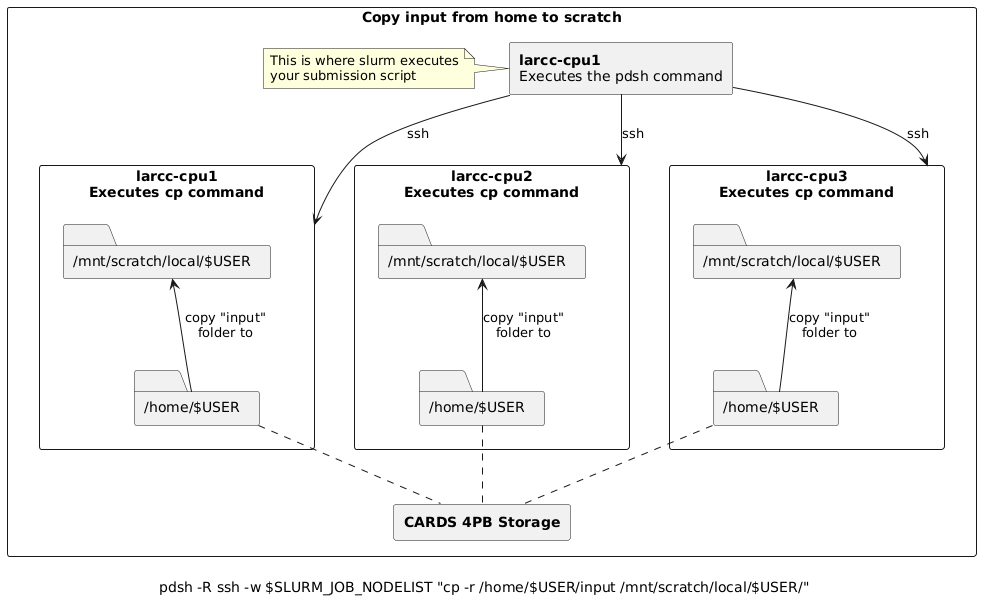

Understanding Storage on Compute Nodes
######################################

When working on any compute node within the system, there are
two primary types of storage available to users: ``scratch`` storage and ``home`` storage.
These are illustrated in the diagram below:

.. image:: images/logical_storage_architecture.png
   :width: 600
   :alt: Logical Storage Architecture

Storage Types
=============

``scratch`` Storage
-------------------
- **Local to each compute node**: This means it is **not shared** across nodes.
- **High performance**: Offers significantly faster read/write speeds compared to ``home`` storage.
- **Limited capacity**: Typically smaller in size, so it's best suited for temporary files and high-speed I/O operations during job execution.
- **Data retention policy:** ALL DATA IS REMOVED after a job finishes.

``home`` Storage
----------------
- **Shared across all nodes**: Accessible from any compute node in the system.
- **Large capacity**: Designed to store a user's persistent data, such as source code, datasets, and results.
- **Slower access**: Due to its shared nature, read/write operations are generally slower than ``scratch`` storage.
- **Data retention policy:** Data is kept as this storage space is designed to hold persistent data.

Recommended Workflow
####################

A common and efficient workflow for running jobs on the system is:

1. **Prepare Input Data**: Copy necessary input files from your ``home`` storage to the node's local ``scratch`` storage at the start of your job.
2. **Run the Application**: Configure your application to read from and write to the ``scratch`` storage during execution.
   This takes advantage of its high-speed performance.
3. **Save Results**: Once the job completes, copy the output files back to your ``home`` storage for long-term retention.

See Section :ref:`Copying data between home and scratch <storage_copy_data>` for more information on how to implement
this worflow.

.. note::

   Always ensure that your input and output data will fit within the available space on ``scratch`` storage.
   If your files exceed this capacity, you may need to adjust your workflow accordingly.

.. _storage_copy_data:

Copying Data Between Home and Scratch
=====================================

To efficiently transfer data between your shared ``home`` storage and node-local ``scratch`` storage, you can use ``pdsh``—a parallel remote shell client that executes commands across multiple nodes simultaneously.

The general template for the ``pdsh`` command includes three key components:

- ``-R ssh``: Specifies SSH as the remote shell method (always use ``ssh``).
- ``-w $SLURM_JOB_NODELIST``: Targets all nodes allocated to your job.
- **Remote command**: Executes on each node, leveraging the fact that ``home`` is shared while ``scratch`` is local.

Below are common usage patterns:

Copy input data from home to scratch on all nodes
-------------------------------------------------

.. code-block:: bash

   pdsh -R ssh -w $SLURM_JOB_NODELIST "cp -r /home/$USER/input /mnt/scratch/local/$USER/"

Copy results from scratch to home
---------------------------------

.. warning::
   When copying results back to ``home``, ensure unique filenames or directories to prevent nodes from overwriting each other's output. The examples above use the node's hostname as a suffix to avoid conflicts.

.. code-block:: bash

   # Copy results from scratch to home, appending hostname to avoid overwrites
   pdsh -R ssh -w $SLURM_JOB_NODELIST "cp -r /mnt/scratch/local/$USER/results /home/$USER/results_\`hostname\`"

   # Alternatively, move results from scratch to home
   pdsh -R ssh -w $SLURM_JOB_NODELIST "mv /mnt/scratch/local/$USER/results /home/$USER/results_\`hostname\`"

Batch Script Example
--------------------

Here's how this workflow fits into a typical Slurm batch script:

.. code-block:: bash

   #!/bin/bash
   #SBATCH ...

   # Copy input to scratch
   pdsh -R ssh -w $SLURM_JOB_NODELIST "cp -r /home/$USER/input /mnt/scratch/local/$USER/"

   # Run your application
   # ...

   # Copy results back to home
   pdsh -R ssh -w $SLURM_JOB_NODELIST "cp -r /mnt/scratch/local/$USER/results /home/$USER/results_\`hostname\`"

Simplified Copy for Aggregated Results
--------------------------------------

If your application aggregates results on the submission node (e.g., via MPI reduction), and per-node outputs are not needed, you can use a standard copy command:

.. code-block:: bash

   #!/bin/bash
   #SBATCH ...

   # Copy input to scratch
   pdsh -R ssh -w $SLURM_JOB_NODELIST "cp -r /home/$USER/input /mnt/scratch/local/$USER/"

   # Run your application
   # ...

   # Copy final results from scratch to home
   cp -r /mnt/scratch/local/$USER/results /home/$USER/
