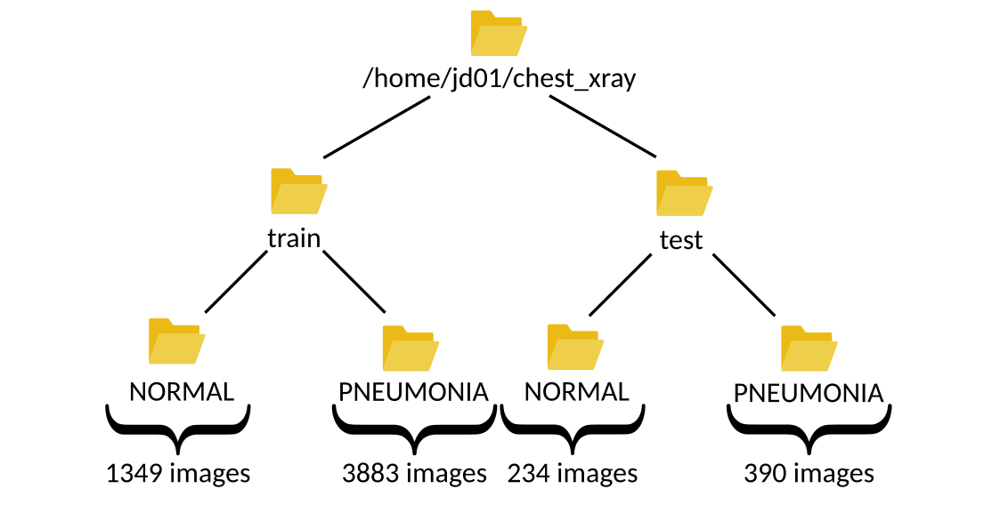

AI Use Cases
############

Pneumonia detection based on Chest X-Ray
========================================

This use-case is adapted from the Kaggle notebook
`Chest X-Ray (Pneumonia) - CNN & Transfer Learning <https://www.kaggle.com/code/jonaspalucibarbosa/chest-x-ray-pneumonia-cnn-transfer-learning/notebook>`_.

The purpose of the notebook is to apply Convolutional Neural Networks (CNNs) to Chest X-Ray images in order to identify cases of Pneumonia.
The dataset used is version 3 of the `Chest X-ray Images <https://www.kaggle.com/datasets/tolgadincer/labeled-chest-xray-images>`_, which includes separate folders for training and testing.
Within the notebook, the training set is further split into training and validation subsets.

Three approaches are explored for image classification:

1. Basic CNN architecture - A simple model built from scratch.
2. Transfer Learning - Using a pretrained model with frozen layers to extract features.
3. Fine-Tuning - Unfreezing the final layers of the pretrained model to improve performance.

To run the notebook's code in LARCC, you can:

1. Download the notebook from Kaggle, launch an instance of jupyter as described :ref:`here <jupyter>` and load the notebook in Jupyter.
2. Convert the notebook into a python script and run it through a batch or interactive job.

Option 2 offers added benefits like the abilty to speed-up the training of your models, consuming less memory and even creating pipelines
where multiple models can be trained at the same time.

There is, however, a slight problem no matter which option is chosen. The code uses an older version of tensorflow and thus must
be adapted to ensure it runs properly at the training phase.

Let's start by getting acquinted with the data. When you download and unzip the dataset from kaggle, you end up with 2 folders.
One that has all the images related to training and validation, and the other has images for testing.
For example, assuming the user ``jd01`` stored the data in ``/home/jd01/chest_xray``, the directory structure would
look as below:

The ``train`` folder has 5232 images total, out of which 1349 are from healthy patients and 3883 from sick patients.
The ``test`` folder has 624 images total, out of which 234 are from healthy patients and 390 from sick patients. Both
of these are depicted below: 

.. list-table:: 

    * - .. figure:: images/chest-xray/train_data_dist_barplot.png
           :scale: 70%

           Training data sample distribution

      - .. figure:: images/chest-xray/test_data_dist_barplot.png
           :scale: 70%

           Test data sample distribution
    * - .. figure:: images/chest-xray/train_data_dist_pieplot.png
           :scale: 70%

           Training data percentual distribution

      - .. figure:: images/chest-xray/test_data_dist_pieplot.png
           :scale: 70%

           Test data percentual distribution

We'll first load all the images from the ``train`` folder into our program and split them into 2 groups. 
One group will contain 20% of the images (i.e 0.20*5232 ~= 1046) and be used for validation purposes
while the other 80% (i.e. 5232 - 1046 = 4186) is used for training. Then, we'll load the images in the ``test`` folder,
but won't really use them until after the model has been trained.

.. list-table:: 

    * - .. figure:: images/chest-xray/cnn_learning_curve_accuracy.png
           :scale: 70%

           Accuracy of CNN

    * - .. figure:: images/chest-xray/cnn_learning_curve_loss.png
           :scale: 70%

           Loss of CNN
    * - .. figure:: images/chest-xray/tl_learning_curve_accuracy.png
           :scale: 70%

           Accuracy of Transfer Learning

    * - .. figure:: images/chest-xray/tl_learning_curve_loss.png
           :scale: 70%

           Loss of Transfer Learning
    * - .. figure:: images/chest-xray/ft_learning_curve_accuracy.png
           :scale: 70%

           Accuracy of Fine Tuning

    * - .. figure:: images/chest-xray/tl_learning_curve_loss.png
           :scale: 70%

           Loss of Fine Tuning

Med-BERT
========

The Med-BERT model is a natural language processing model for disease prediction based on EHR records.
You can read more about it in the paper:

    *Laila Rasmy, Yang Xiang, Ziqian Xie, Cui Tao, and Degui Zhi. "Med-BERT: pre-trained contextualized embeddings on large-scale structured electronic health records for disease prediction." npj digital medicine 2021* `<https://www.nature.com/articles/s41746-021-00455-y>`_.

Due to vendor restrictions, the authors could not share their trained model:

    *Initially we really hoped to share our models but unfortunately, the pre-trained models are no longer sharable. According to SBMI Data Service Office: "Under the terms of our contracts with data vendors, we are not permitted to share any of the data utilized in our publications, as well as large models derived from those data."*

but they shared code to reproducte Med-BERT at `<https://github.com/ZhiGroup/Med-BERT>`_.

If you have access to data that aligns with Med-BERT's requirements, you can leverage LARCC's resources to create your own instance of Med-BERT.
Here is an example for the pre-training phase:

#. Setup code dependencies. For this case, the pretraining code depends on tensorflow 1.x, which

    - is only compatible with python 3.5 to 3.7. The cluster comes with python 3.9 by default and, currently, there is no module for any
      of these python versions. Thus, you will need to use :ref:`Conda <conda>` to create an environment with the desired python version.
    - is compatible with protobuf versions prior 4.0.
    - is compatible with cuda versions up to CUDA 10. LARCC's gpus are only compatible with CUDA versions greater than 11.8, so you will need to
      use CPUs for the pretraining.

    .. code-block:: bash

        module load miniforge3
        conda create --name my_tf1 python=3.7 tensorflow-gpu 'protobuf<=3.20' pandas numpy matplotlib

#. Download code and rename all spaces in folder names with ``_`` to avoid conflicts in Linux.

    .. code-block:: bash

        cd ~
        git clone https://github.com/ZhiGroup/Med-BERT.git
        find Med-BERT -type d -name '*[[:space:]]*' | xargs -I '{}' sh -c "mv '{}' \`echo '{}' | sed 's/ /_/g'\`"

#. Preprocess the data you will use for the pretraining step. In the example below, the option ``--output_file='ehr_tf_features'``
   will create a tensorflow formatted features file named ``ehr_tf_features`` required for the pretraining.

    .. code-block:: bash

        cd ~/Med-BERT/Pretraining_Code/Data_Pre-processing_Code
        # NOTE: You can do the following on a batch job instead.
        srun --partition=compute --job-name med-bert --time=01:00:00 --ntasks-per-node=128 --cpu-bind=cores --pty /bin/bash -i
        cd ~/Med-BERT/Pretraining_Code/Data_Pre-processing_Code
        module load miniforge3
        conda activate my_tf1
        # NOTE: This assumes your input file is stored in the path below. Change it to something
        # else if you store your data somewhere else
        INPUT=~/Med-BERT/Pretraining_Code/Data_Pre-processing_Code/data_file.tsv
        OUT_PREFIX=preprocessed
        python3 preprocess_pretrain_data.py "$INPUT" NA "$OUT_PREFIX"
        python3 create_BERTpretrain_EHRfeatures.py \
            --input_file="$OUT_PREFIX.bencs.train" \
            --output_file='ehr_tf_features' \
            --vocab_file="$OUT_PREFIX.types" \
            --max_predictions_per_seq=1 \
            --max_seq_length=64
        exit

#. Create a submission script for the pretraining phase. Assume the script below is written to ``~/med-bert.sbatch``.

    .. note::

        You may want to perform some preliminary runs with smaller values for The
        ``--num_train_steps`` and ``--num_warmup_steps`` options where you tweak the number of cores
        on each run. The idea is to find the optimal number of cores to use as too many cores does not
        always guarantee better performance. For example, using the provided example data file from
        the Med-BERT repo:
        
        .. list-table:: Pretraining of Med-BERT example data with ``--num_train_steps=4500`` and ``--num_warmup_steps=1000``
           :widths: 10 10
           :align: center
           :header-rows: 1

           * - Cores
             - Time
           * - 128
             - 15m36.219s
           * - 64
             - 12m36.336s
           * - 32
             - 18m28.998s
           * - 12
             - 19m52.057s

    .. literalinclude:: scripts/med-bert.sbatch
     :language: bash
     :linenos:

#. Submit script to slurm with ``sbatch ~/med-bert.sbatch``.